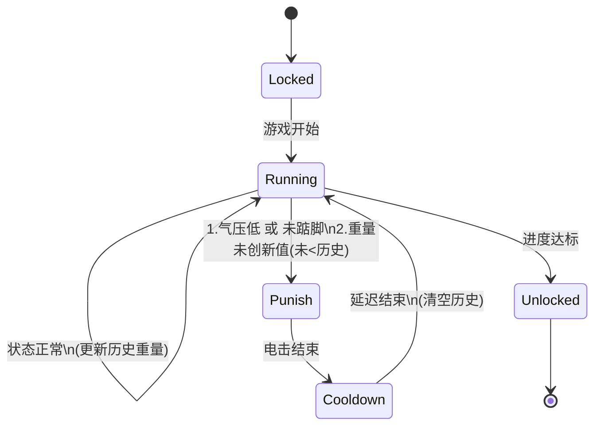

# 喝水/憋尿解锁玩法（状态机版）

面向设备：电子秤、电脉冲发生器（电击器）、跳蛋控制器、踮脚感受器、气压计（括约肌压力检测）。  
目标：在锁定状态下，通过「饮水解锁」或「尿量解锁」达成目标重量变化。

## 参数配置
- `TargetWeight`：目标重量变化值（克）
- `ChangeThreshold`：有效变化阈值（克/秒，饮水为下降/尿量为上升）
- `StableWindow`：历史重量窗口大小，同时作为惩罚后的冷却时间（默认 30秒）
- `ShockIntensity`：电击惩罚强度（0-100）
- `ShockDuration`：电击惩罚持续时间（秒）
- `PressureThreshold`：括约肌压力阈值（低于此值视为未提肛，触发惩罚）
- `TiptoeThreshold`：踮脚判定阈值（数值或状态，未达标视为未踮脚）
- `VibeStartProb`：跳蛋每秒启动概率（0-1）
- `VibeIntensity`：跳蛋启动强度（0-100）
- `VibeDuration`：跳蛋单次持续时间（秒）

## 设备动作约定
- **电击器**：
  1. 气压不足或未踮脚 -> 触发惩罚。
  2. 重量未优于历史记录 -> 触发惩罚。
- **跳蛋**：在监测过程中随机启动，按设定强度和时长运行。
- **电子秤**：每秒记录重量，维护最近 `StableWindow` 秒的历史数据。
- **气压计/踮脚**：实时监测玩家姿态与收缩力度。

## 核心状态机

### 状态定义
- `Locked`：上锁，等待游戏开始
- `Running`：核心监测中（每秒检测气压、踮脚、重量）
- `Punish`：惩罚状态（执行电击）
- `Cooldown`：冷却/延迟状态（电击后暂停检测，防止连续惩罚）
- `Unlocked`：任务完成，解锁
- `End`：结束

### 监测逻辑（Running 状态）
每秒执行以下检查：
1.  **姿态检测**：
    *   若 `Pressure < PressureThreshold` （气压不足） -> **转入 Punish**
    *   若 `TiptoeStatus == False` （未踮脚） -> **转入 Punish**
2.  **重量检测**：
    *   维护一个长度为 `StableWindow` 秒的历史重量列表。
    *   **饮水模式**：若 `当前重量 >= Min(历史重量列表)` -> 视为未有效喝水，**转入 Punish**。
    *   **尿量模式**：若 `当前重量 <= Max(历史重量列表)` -> 视为未有效排尿，**转入 Punish**。
    *   **通过**：若符合要求（比历史记录更优），则将当前重量加入历史列表（移除最旧数据），并累积进度。
3.  **随机干扰**：
    *   按概率 `VibeStartProb` 启动跳蛋。

### 迁移规则
- `Locked -> Running`：游戏开始。
- `Running -> Punish`：检测到气压低、未踮脚或重量未达标。
- `Punish -> Cooldown`：电击执行完毕。
- `Cooldown -> Running`：延迟时间（`StableWindow`）结束。**注意：**重新进入 Running 时应清空历史重量记录，重新开始积累，给予玩家缓冲期。
- `Running -> Unlocked`：累计有效变化量 >= `TargetWeight`。
- `Unlocked -> End`：游戏结束。

### 状态机图 (Mermaid)

## 详细流程说明
1.  **启动**：设备上锁，进入 `Locked` 状态。
2.  **监测**：进入 `Running` 状态，系统每秒检测：
    -   玩家必须保持**提肛**（气压达标）且**踮脚**。
    -   玩家必须持续**喝水/排尿**，使得当前重量始终优于过去 `StableWindow` 秒内的记录（即持续变轻或变重）。
    -   若任一条件不满足，立即触发电击。
3.  **惩罚与冷却**：
    -   进入 `Punish` 状态执行电击。
    -   电击结束后进入 `Cooldown` 状态，暂停检测 `StableWindow` 秒，给玩家恢复调整的时间。
    -   冷却结束后重置历史数据，重新开始监测。
4.  **解锁**：
    -   当累计变化的重量达到 `TargetWeight`，锁具打开，游戏通关。
