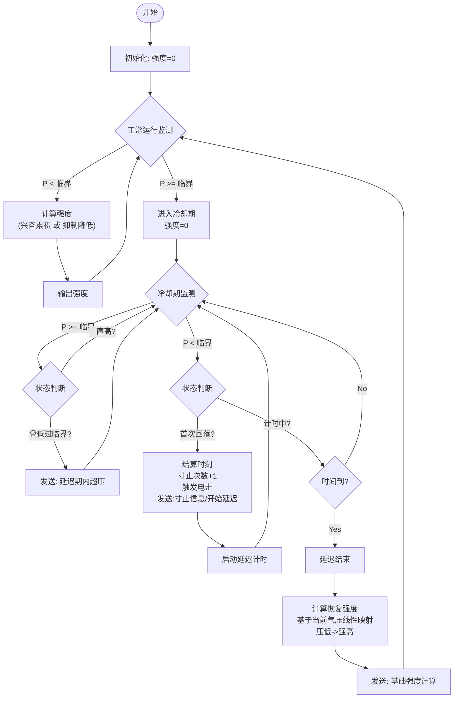

# 气压寸止玩法 (新版逻辑)

本文档说明基于 `寸止游戏2_玩法逻辑.md` 并结合 `新修改内容.txt` 调整后的新版玩法逻辑。

## 核心逻辑概述

游戏依然基于气压传感器反馈调节震动强度，但在 **过载处理**、**冷却流程** 以及 **恢复后的初始强度计算** 上进行了重要调整。

主要变更点：
1.  **过载触发时机**：明确了压力回落（小于临界值）时才正式结算“寸止”次数并触发电击/延迟。
2.  **延迟期交互**：在冷却延迟期间，会根据气压波动（再次超压或保持低压）发送不同反馈文本。
3.  **动态恢复强度**：冷却结束后，不再从零开始，而是根据当前气压动态计算一个非零的起始强度。

---

## 详细流程

### 1. 初始化
- 游戏开始时，初始强度设为 **0**。
- 初始化设备：电机归零、锁上锁、电击预设电压。
- 设定参数：临界气压 (`P_critical`)，中间气压 (`P_mid`)，延迟时间等。

### 2. 状态循环与逻辑

游戏逻辑主要由气压变化驱动，分为以下几个关键状态节点：

#### A. 正常运行阶段 (Normal & Edging)

此阶段逻辑与原版类似，根据气压处于不同区间调整强度：

1.  **兴奋阶段 (P <= P_mid)**
    - 强度随时间逐步提升。
    - 叠加随机扰动。
2.  **寸止/抑制阶段 (P_mid < P < P_critical)**
    - 强度随气压升高而线性降低（从 `MidIntensity` 降至 0）。

#### B. 过载与冷却阶段 (Overload & Cooldown)

当气压达到或超过临界值 (`P >= P_critical`) 时，进入此阶段。

**1. 进入过载 (P >= P_critical)**
- 强度立即设为 **0**。
- 标记状态为“进入冷却期/等待回落”。

**2. 冷却期监控 (In Delay Period)**
在此期间，持续监测气压变化：

- **若气压持续 >= P_critical**：
    - 保持强度为 0。
    - **再次超压反馈**：如果在延迟期内，气压曾低于临界值后又再次超过临界值，发送 **“延迟期内超压”** 文本。

- **若气压回落 < P_critical**：
    - **首次回落结算 (Edge Event)**：
        - 当检测到气压从 >= 临界值 变为 < 临界值时：
        - **寸止次数 +1**。
        - **触发电击** (如果配置了电击)。
        - 发送 **“寸止信息”** 文本。
        - 发送 **“开始延迟”** 文本。
        - **启动延迟计时器**。
    - **计时中**：
        - 保持强度为 0，等待倒计时结束。

**3. 延迟结束与恢复 (Recovery)**
当延迟计时结束时，游戏回归正常运行阶段，但初始强度计算方式改变：

- **计算恢复强度**：
    - 不再从 0 开始。
    - 根据当前气压 (`P`) 进行线性映射计算初始强度。
    - **算法逻辑**：
        - 参考映射范围 (X轴)：默认 **17 - 21** (可配置)。
        - **反向映射**：
            - 气压越低 -> 初始强度越高。
            - 气压越高 -> 初始强度越低。
    - 发送 **“基础强度计算”** 文本。
- **应用强度**：将计算出的强度作为当前的基础强度，继续进入 **兴奋阶段** 的逻辑。

---

## 逻辑对比总结表

| 功能点 | 原版逻辑 | 新版逻辑 |
| :--- | :--- | :--- |
| **过载触发** | P >= 临界时立即触发电击并冷却 | P >= 临界时强度归零；**P < 临界 (回落) 时** 触发电击、计数并开始计时 |
| **延迟期反馈** | 等待回落低于 P_mid | 监控 P 与 P_critical 关系；区分“首次回落”和“回落后反弹”发送不同文本 |
| **恢复初始强度** | 默认逻辑 (通常较低或从0累积) | **动态计算**：基于当前气压反向映射 (压低强高，压高强低) |
| **寸止计数** | 触发过载时计数 | 压力回落时计数 |

## 流程图 (Mermaid)

