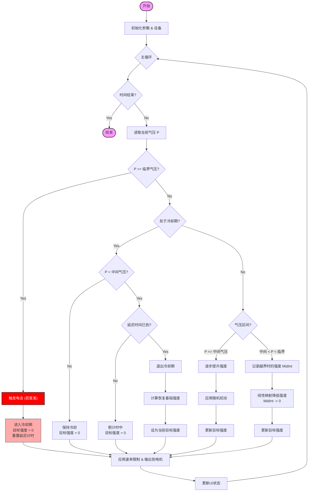

# 气压寸止玩法 (123版) 逻辑说明

本文档说明 `寸止游戏2.js` 的核心玩法逻辑。该玩法基于气压传感器反馈，动态调节震动强度，并在达到临界压力时触发惩罚（电击）和强制冷却。

## 核心逻辑概述

游戏主要分为三个状态阶段：
1.  **兴奋/累积阶段 (Normal Phase)**：气压较低，强度随时间逐步提升，引诱玩家兴奋。
2.  **寸止/抑制阶段 (Edging Phase)**：气压升高（超过中间值），强度随气压升高而迅速降低，迫使玩家控制压力。
3.  **惩罚/冷却阶段 (Punishment/Cooldown Phase)**：气压超过临界值，触发电击，强度归零，强制进入冷却时间，直到气压回落并保持一段时间。

## 详细流程

### 1. 初始化
- 设置游戏时长、临界气压、最大强度等参数。
- 初始化设备：电机归零、自动锁上锁、电击预设电压。

### 2. 主循环 (每帧执行)

#### A. 状态判断与计算

根据当前气压 (`P`) 与 临界气压 (`P_critical`)、中间气压 (`P_mid`) 的关系进行分支：

1.  **过载判断 (P >= P_critical)**
    - **触发惩罚**：如果之前未处于冷却期，立即触发一次电击，并记录违规次数。
    - **进入冷却**：强度立即设为 0，标记进入“冷却延迟期”。

2.  **冷却延迟期 (In Delay Period)**
    - **等待回落**：如果气压仍高于 `P_mid`，保持强度为 0，不开始计时。
    - **延迟计时**：当气压低于 `P_mid` 后，开始倒计时（`lowPressureDelay` 秒）。
    - **延迟结束**：倒计时结束后，恢复正常模式。
        - **恢复强度计算**：根据当前气压计算一个基础强度，作为恢复后的起始强度，避免突兀。

3.  **正常/恢复运行**
    - **兴奋阶段 (P <= P_mid)**
        - **逐步提升**：基础强度随时间线性增加 (`intensityGradualIncrease`)。
        - **随机扰动**：在基础强度上增加随机波动 (`stimulationRampRandomPercent`)。
        - **结果**：`TargetIntensity` 缓慢上升。
    - **寸止阶段 (P_mid < P < P_critical)**
        - **记录中间态**：当气压首次超过 `P_mid` 时，记录当前强度为 `MidIntensity`。
        - **线性抑制**：气压越高，强度越低。
        - **公式**：强度从 `MidIntensity` (at `P_mid`) 线性降低到 0 (at `P_critical`)。

#### B. 强度输出
- **速率限制**：为了体验平滑，实际输出强度的变化受 `stimulationRampRateLimit` 限制（除非是刚刚从冷却恢复或强度需要下降，此时允许突变）。
- **设备控制**：将计算出的最终强度发送给电机控制器 (TD01)。

### 3. 结束
- 游戏时间结束或手动停止。
- 设备复位（强度归零、停止电击、解锁）。

## 逻辑流程图

