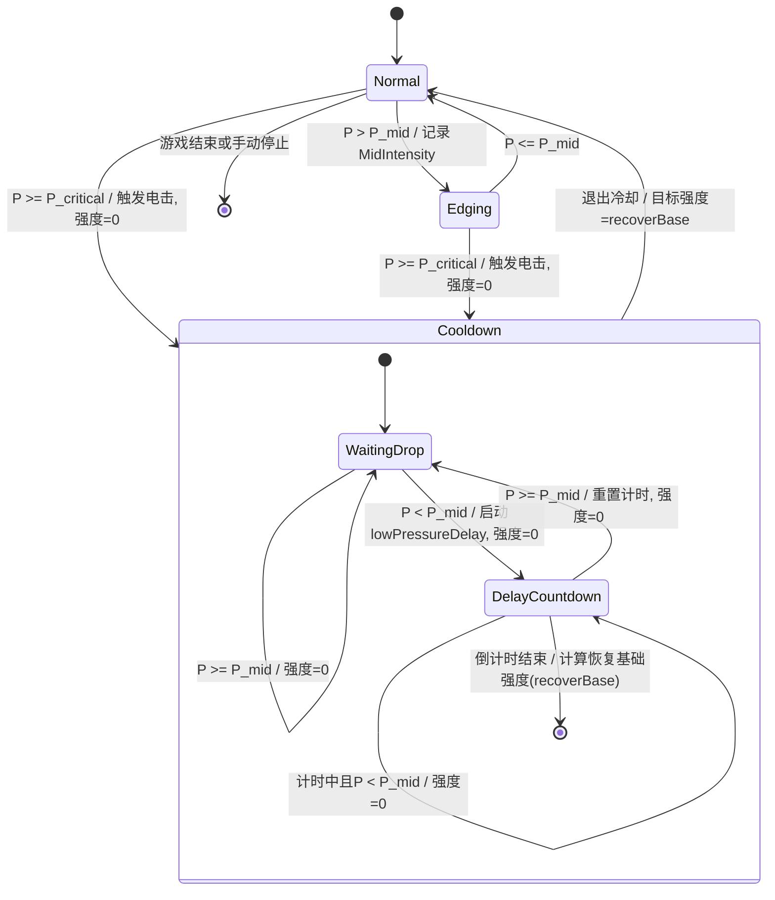

# 气压寸止玩法（状态机版）

基于 `寸止游戏2_玩法逻辑.md`，将核心流程抽象为有限状态机（FSM），用状态与事件驱动来描述强度变化与惩罚/冷却。

## 参数
- `P`：当前气压
- `P_mid`：中间气压
- `P_critical`：临界气压
- `lowPressureDelay`：低压延迟计时（秒）
- `TargetIntensity`：目标强度
- `MidIntensity`：首次越过 `P_mid` 时记录的强度

## 状态机
- `Normal`（兴奋/累积）：强度随时间缓慢上升并叠加随机扰动
- `Edging`（寸止/抑制）：当 `P > P_mid`，强度按线性映射从 `MidIntensity` 降到 0（在 `P_critical` 处）
- `Cooldown`（冷却期，含两个子态）：
  - `WaitingDrop`：强度为 0，等待 `P < P_mid`
  - `DelayCountdown`：强度为 0，`P < P_mid` 时启动倒计时，结束后计算恢复强度

## 迁移规则
- `Normal -> Edging`：当 `P > P_mid`，记录 `MidIntensity`
- `Normal -> Cooldown`：当 `P >= P_critical`，触发一次电击，强度设为 0
- `Edging -> Normal`：当 `P <= P_mid`
- `Edging -> Cooldown`：当 `P >= P_critical`，触发一次电击，强度设为 0
- `Cooldown.WaitingDrop -> Cooldown.DelayCountdown`：当 `P < P_mid`，启动 `lowPressureDelay` 倒计时
- `Cooldown.DelayCountdown -> Cooldown.WaitingDrop`：当计时中 `P >= P_mid`，重置计时
- `Cooldown.DelayCountdown -> Normal`：倒计时结束，计算恢复基础强度设为当前目标强度
- `任何状态 -> 结束`：游戏时间结束或手动停止

## 附加规则
- 强度输出带速率限制；当从冷却恢复或需要迅速下降时允许突变。
- 强度变更实时发送至设备控制器。

## 状态机图

