# 社区游戏创作者分成 · 本地验收报告

- 日期：2026-10-06
- 验收分支：`docs/creator-payout`（worktree `E:\develop\control-panel\.tmp\creator-payout`，HEAD `3e5fbbf`）
- 验收人：独立验收（非开发者，发现问题只记录、不改业务代码）
- 结论：**11 个步骤全部通过**，发现 1 个中等问题 + 3 个低风险/信息项，见第 3 节；4 个问题已修复并复测通过，见第 5 节

## 0. 测试环境与说明

| 组件 | 地址 | 说明 |
| --- | --- | --- |
| game-platform（Go） | `http://127.0.0.1:8787` | `GAME_PLATFORM_ENV=development`，filesystem 存储，库/对象目录都在 `.tmp/accept` |
| 假身份服务 | `http://127.0.0.1:8791` | `game-platform/tools/fake-identity.js`（仓库自带，未改动） |
| 玩法站（静态） | `http://127.0.0.1:8080` | 隔离副本 `.tmp/site`（含本流程生成的 registry.json），避免污染仓库里的线上 registry |
| 商城（Next.js） | 随机端口 | shop worktree 用 Playwright + 临时 SQLite 库启动，**不连生产** |
| 手机端 Flutter | — | 只跑单测，无界面截图 |

身份 token（仓库自带的 smoke 假身份，非真实账号）：

- `author-token` → `mobile-author` / `author@example.com`
- `author2-token` → `mobile-author2` / `author2@example.com`
- `admin-token` → `mobile-admin` / `admin@example.com`（isAdmin）

> **登录是模拟的**：投稿平台前端把登录态放在 `sessionStorage['game-platform-mobile-token']`，
> 本报告通过浏览器 `evaluate` 写入 token 后刷新页面来模拟登录，**不是用真实账号密码登录**。
> 商城侧同理：测试脚本直接签商城会话 cookie，不走邮箱密码登录（邮箱登录已迁到账号中心）。

本次验收**只连本地**，未 push、未部署、未接触任何生产环境。

## 1. 流程逐步

### 步骤 1 · 作者投稿并发布

**操作**：作者 `mobile-author`（署名 Smoke Author）用 ZIP 投稿 `accept-game-a 1.0.0` → 管理员在审核后台批准发布。

**预期**：投稿完成校验通过，发布后出现在社区游戏列表，registry.json 出现该游戏。

**实际**：通过。`complete` 返回 200，管理员 publish 返回 200，`/api/admin/community-games` 出现 `accept-game-a`。

**证据**：审核后台列表（含 game_id 状态徽标）

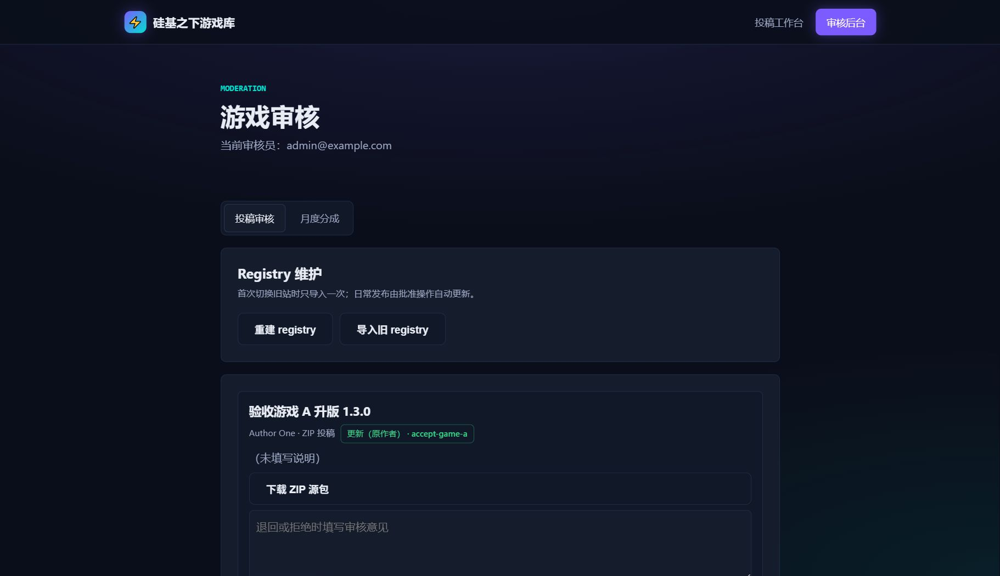

---

### 步骤 2 · 另一作者用同一 game_id 投稿被拒

**操作**：作者 `mobile-author2` 投稿 `accept-game-a 1.0.0`（ID 已被作者 A 占用）。

**预期**：拒绝，提示改用其他 id。

**实际**：通过。`complete` 返回 HTTP 400：

```
该游戏 ID 已被占用，请改用其他 id（accept-game-a）
```

**证据**：

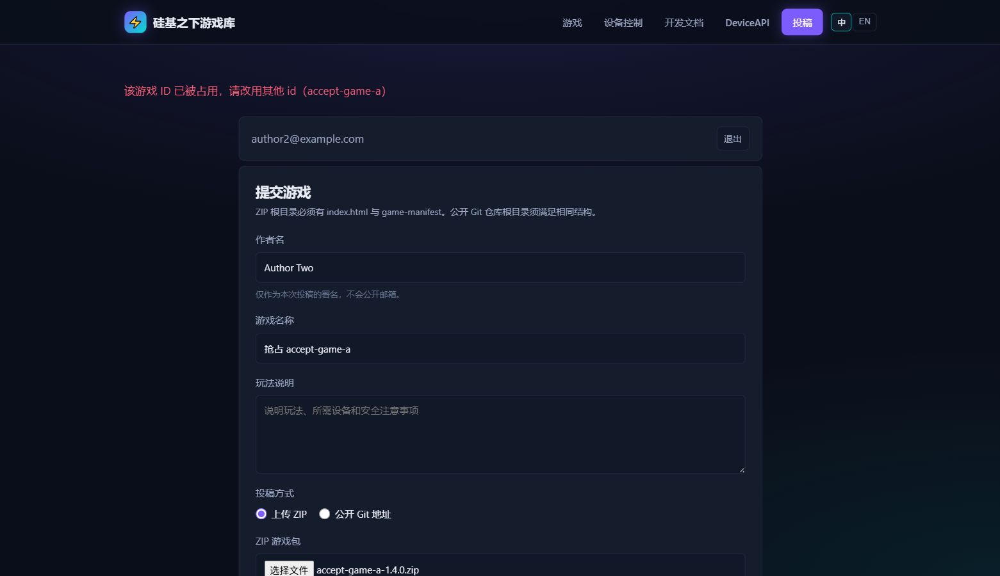

---

### 步骤 3 · 自己的游戏同版本被拒 / 升版通过

**操作**：作者 A 对 `accept-game-a`（当前最新 1.4.0）重投 1.2.0 → 再投 1.3.0。

**预期**：同版本或低版本被拒；高版本通过。

**实际**：通过。重投 1.2.0 返回 HTTP 400：

```
版本号 1.2.0 必须高于该游戏 ID 当前最新版本 1.4.0
```

1.3.0 发布成功。

**证据**：

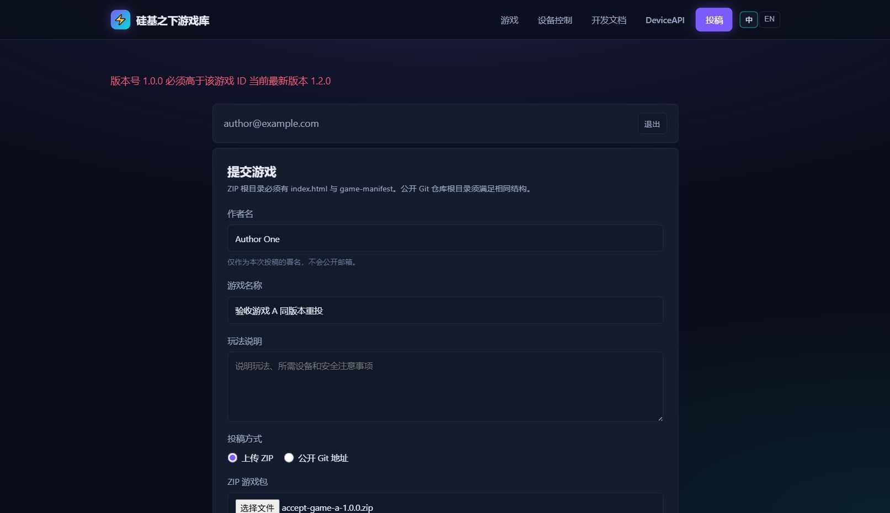

---

### 步骤 4 · 管理员更新他人游戏，归属不变

**操作**：管理员（署名 Platform Team）发布 `accept-game-a 1.4.0`。

**预期**：允许发布；该 game_id 的**归属作者不变**，审核后台显示「管理员更新」徽标。

**实际**：通过。`/api/admin/community-games` 中 `accept-game-a` 的 `authorId` 仍是 `mobile-author`、`email` 仍是 `author@example.com`。

**证据**：

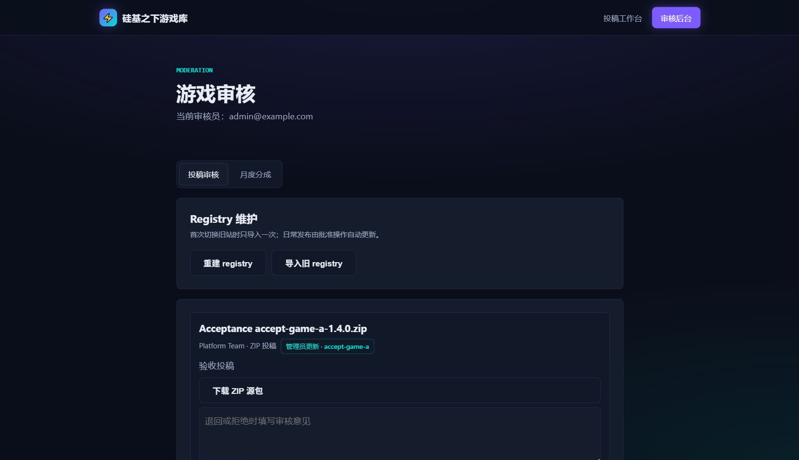

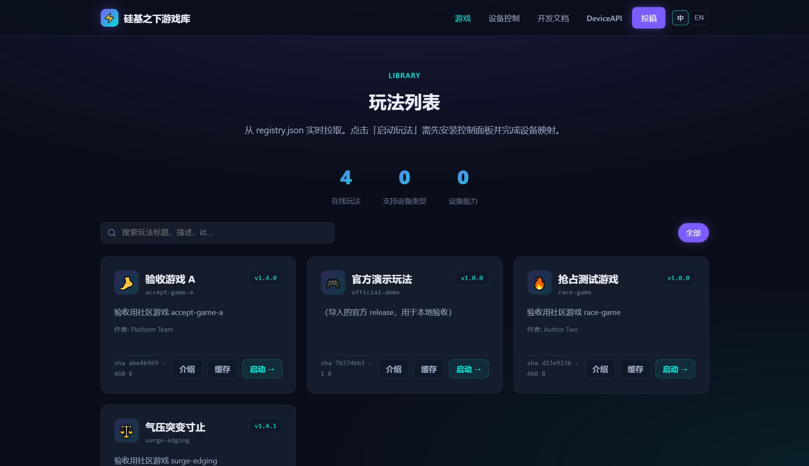

---

### 步骤 5 · 官方 ID 被占用 → 拒绝 → 管理员指定归属 → 转为社区游戏

**操作**（模拟线上 `surge-edging` 这类"只有官方 release、实际是社区作者做的"游戏）：

1. 作者 A 投稿 `official-demo 2.0.0` → 被拒
2. 管理员在「归属指定」把 `surge-edging` 指定给 DK / `author2@example.com`
3. 检查社区游戏列表
4. 作者 DK 升版 `surge-edging 1.4.0` → 通过
5. 管理员更新 `surge-edging 1.4.1` → 归属仍 DK
6. 另一并发场景：`race-game` 已有作者 B 的 1.0.0，作者 A 的 2.0.0 停在 pending

**实际**：全部通过。

- 非管理员投官方 ID：HTTP 400 `游戏 ID "official-demo" 为官方游戏保留，只有管理员可以更新`
- 指定归属时邮箱未登录过：HTTP 400 `该邮箱尚未登录过投稿平台，请让作者先用这个邮箱登录一次`
- 指定后 `surge-edging` 出现在社区游戏列表（DK / author2@example.com / 1.4.1）
- DK 发布 1.4.0 成功；管理员发布 1.4.1 后归属仍为 DK
- 并发 pending 的 `race-game 2.0.0`：发布事务内的二次归属校验拦住，**连管理员发布也被拒** `该游戏 ID 已被占用，请改用其他 id（race-game）`

**证据**：

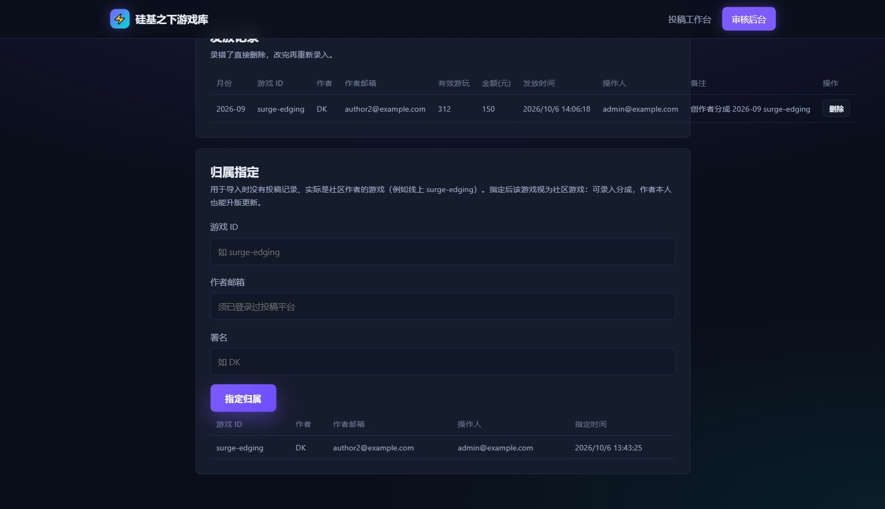

---

### 步骤 6 · 月度分成 tab：录入 / 重复拒绝 / 非社区游戏拒绝 / 删除后重录

**操作**：在审核后台「月度分成」tab 录入 `surge-edging` / 2026-09 / 312 次 / 150 元 / 备注「创作者分成 2026-09 surge-edging」；再录一次同样的记录；再给官方游戏 `official-demo` 录一条；删除后重新录入。

**实际**：全部通过。

- 录入成功，表格出现该行（月份 / 游戏 ID / 作者 / 作者邮箱 / 有效游玩 / 金额 / 发放时间 / 操作人 / 备注 / 删除）
- 重复录入：HTTP 409 `该游戏这个月已经录入过发放记录，如需修改请先删除原记录`
- 官方游戏：HTTP 400 `该游戏 ID 不是社区游戏（没有归属作者），不能录入分成；如果确实是社区作者的导入游戏，请先在「归属指定」里指定作者`
- 删除提示「已删除，可以重新录入。」，重录成功

**证据**：

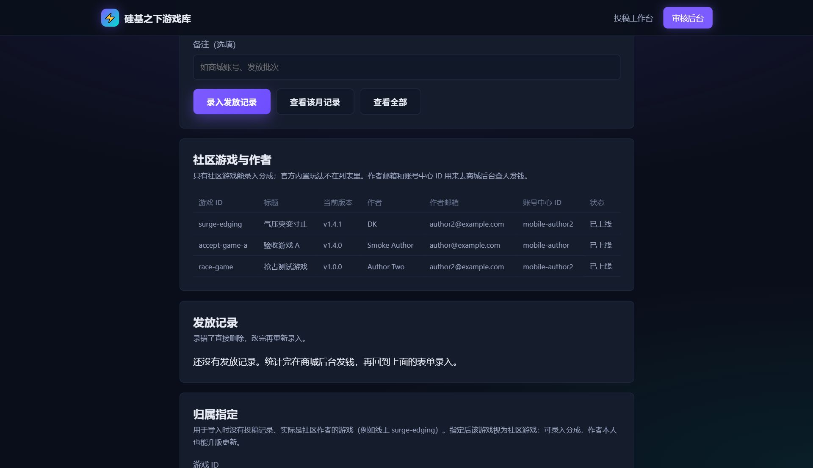

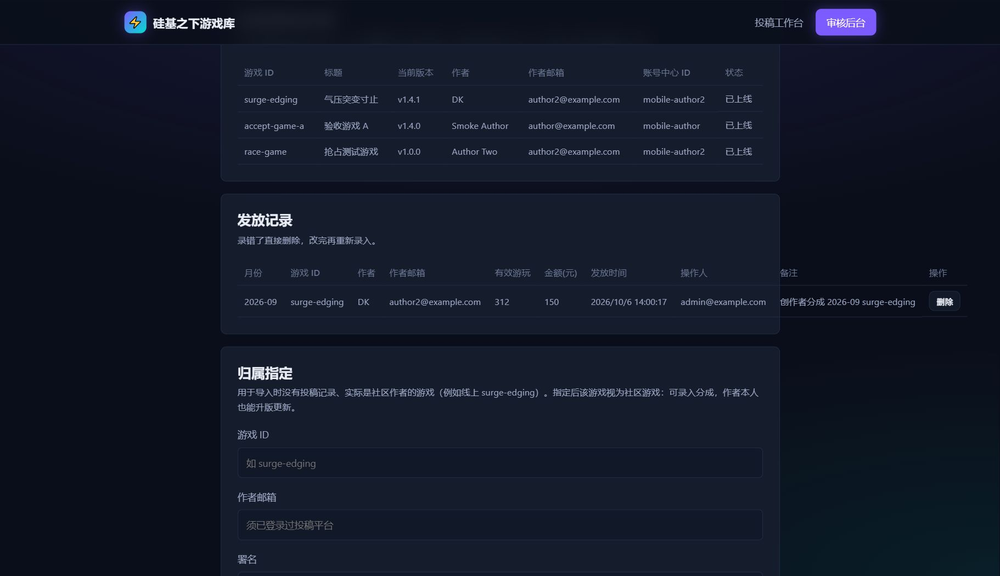

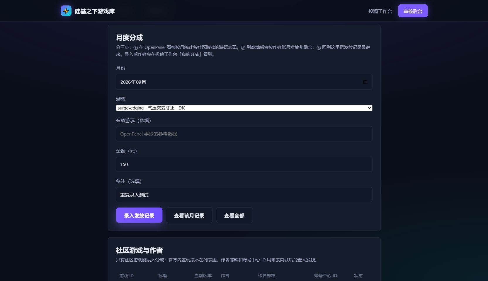

---

### 步骤 7 · 作者可见性：本人可见 / 他人不可见 / 未登录不可见

**操作**：分别以 `author2-token`、`author-token`、无 token 打开 `submit.html`。

**实际**：通过。

- 作者 DK（author2）在「我的分成」看到 `surge-edging · 2026-09`、有效游玩 312 次、150 元、发放时间、备注
- 作者 A（author1）看到空状态「还没有分成记录。平台每月人工统计游玩表现并发放奖励金，发放后这里会显示你游戏各月的金额。」
- 未登录（清掉 token 后刷新）只显示登录表单，看不到「我的分成」

**证据**：

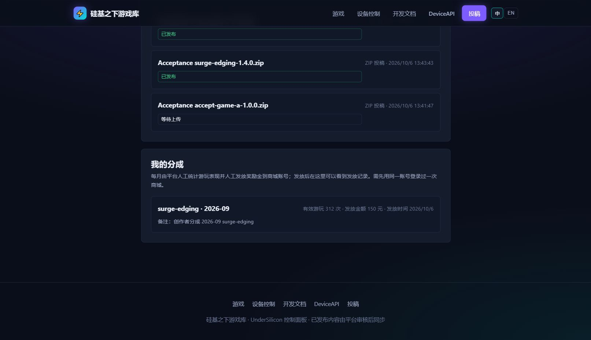

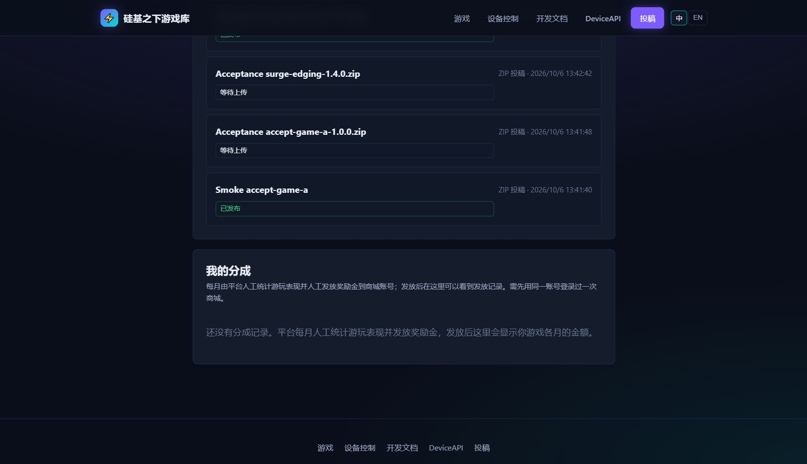

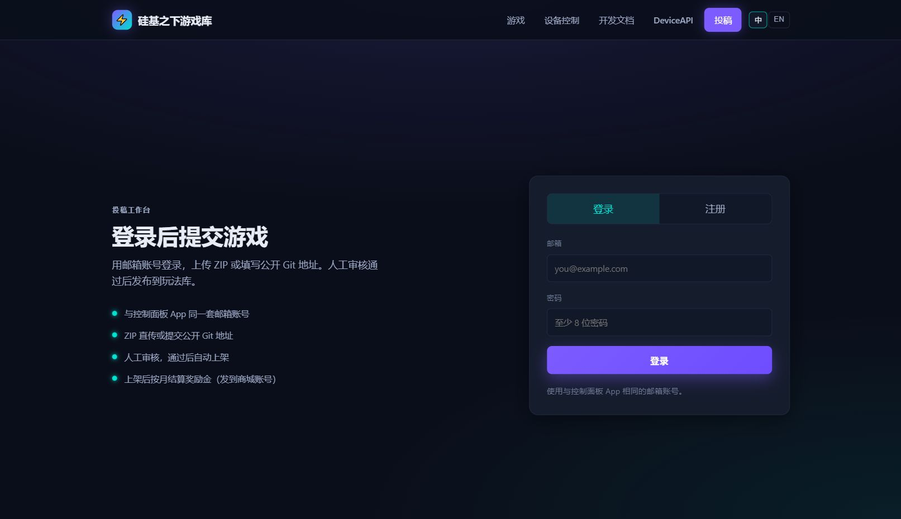

---

### 步骤 8 · 投稿规则页的分成说明

**操作**：打开 `docs/contribute.html`，查看「创作者分成」小节。

**实际**：通过。页面写明：人工统计 / 人工发放到商城账号 / 需先登录商城 / 发放后在「我的分成」查看。

**证据**：

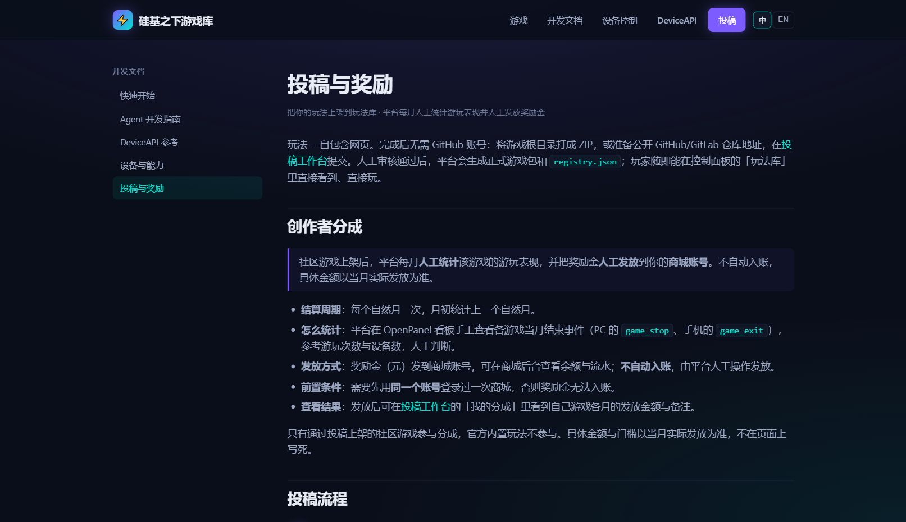

---

### 步骤 9 · 商城侧：按邮箱 / 账号中心 ID 查询并发放奖励金

**操作**：在 shop worktree 跑 `tests/admin-reward-adjust.ts`（Playwright + 临时 SQLite 库，隔离环境），验证 `/admin/reward` 按账号 ID、邮箱、账号中心 ID 三种方式都能查到同一个用户并发放。

**实际**：通过。输出 `Admin reward Playwright smoke OK`。测试覆盖：按账号 ID（272）查、按邮箱（大写 `REWARD-USER@example.com` 也命中）、按账号中心 ID（`acc-reward-272`）查、无 accountNo 用户按邮箱查并发放、按三种标识发放都落到同一用户、备注「创作者分成 2026-11 game_id」写入流水、负数扣减、查不到报错「用户不存在」、用户在 `/zh/profile/reward` 看到余额与备注。

**证据**（脚本自动截图）：

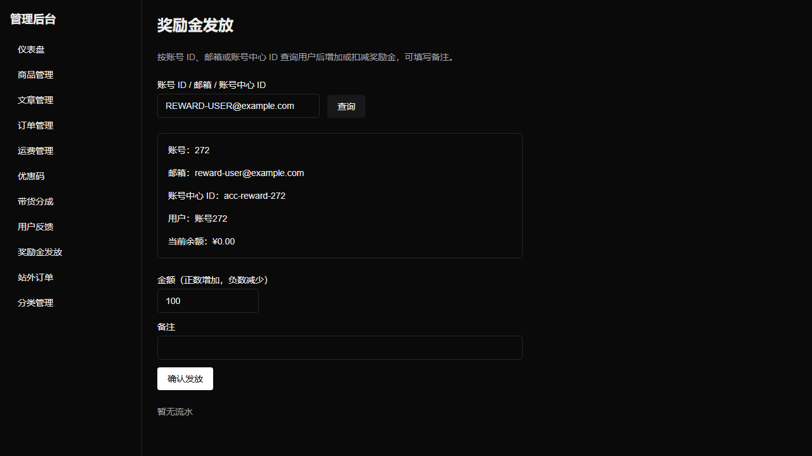

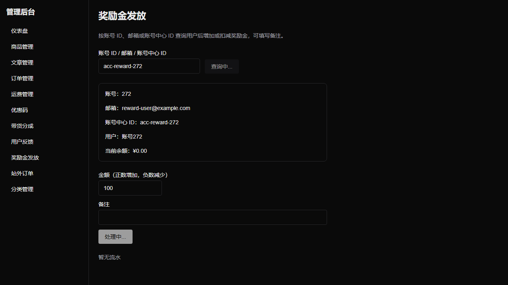

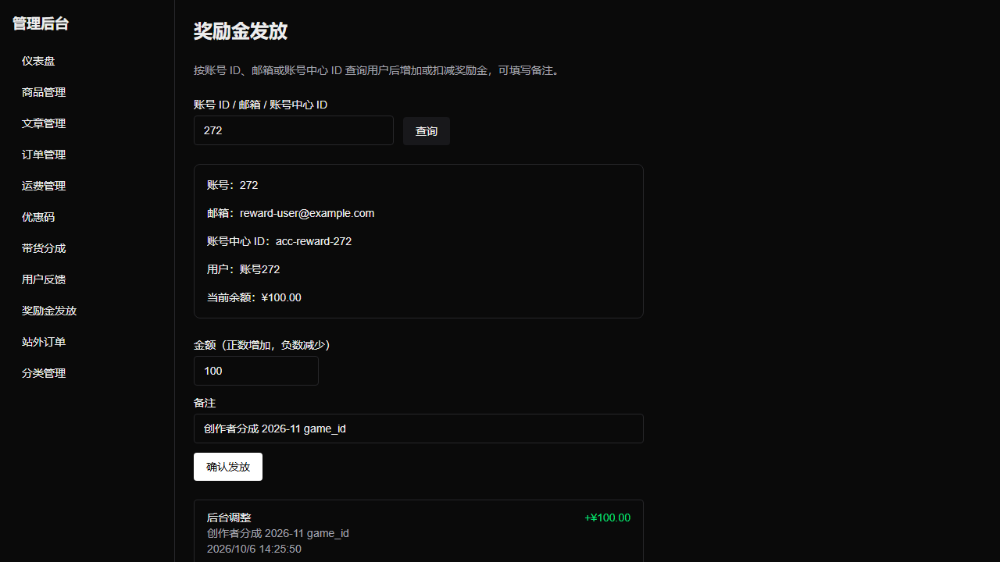

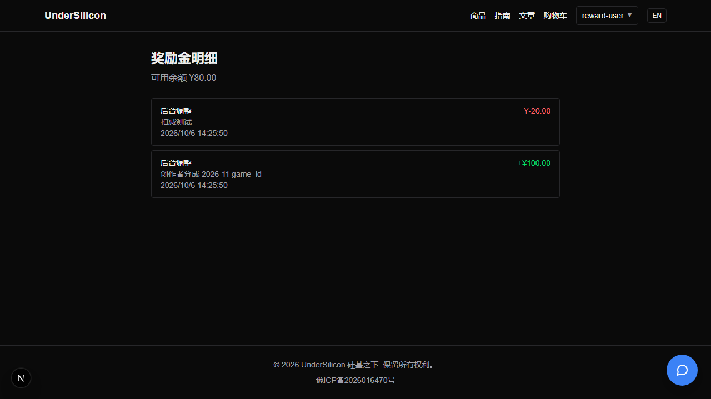

---

### 步骤 10 · 手机端 `game_exit` 埋点字段（无截图）

**操作**：`flutter test test/core/analytics/analytics_test.dart`。

**实际**：通过，6 个用例全绿：

```
00:00 +6: All tests passed!
```

覆盖内容：`game_exit` 补齐 `version` / `source` / `device_*` / `duration_ms` 字段；无版本时省略 `version`；未映射设备时 `device_macs` 为空串；错误退出保留 `exit_reason`；`game_launch` 与 `game_exit` 的 `source` 取值同源（`GameSource.name`）；`game_launch` 字段未变。

`duration_ms` 与 `session_duration_ms` 同时上报（后者为兼容旧看板保留），与运营指南里「两个字段都看，缺一个用另一个」一致。

---

### 步骤 11 · 自动化测试

| 项目 | 命令 | 结果 |
| --- | --- | --- |
| game-platform | `go test ./... -count=1` | `ok github.com/jiandanzhineng/control-panel/game-platform 7.526s`，29 个 Test 全通过（修复后为 32 个，见第 5.5 节） |
| play-registry | `npm test` | `tests 29 / pass 29 / fail 0` |
| 手机端 | `flutter test test/core/analytics/analytics_test.dart` | 6 个用例全通过 |

game-platform 测试覆盖了本次改动的关键点：归属优先级（`game_owners` > 最早社区 release 作者 > 官方保留）、非管理员不能发官方 ID、管理员发他人游戏不改归属、版本必须严格递增、已下架 ID 不能被他人复用、审核列表的 game_id 状态标记、旧 `payout_reports` 表迁移。

## 2. 通过一览

| # | 步骤 | 结果 |
| --- | --- | --- |
| 1 | 作者投稿并发布 | 通过 |
| 2 | 他人用同一 game_id 投稿被拒 | 通过 |
| 3 | 自己同版本被拒 / 升版通过 | 通过 |
| 4 | 管理员更新他人游戏、归属不变 | 通过 |
| 5 | 官方 ID 拒绝 → 指定归属 → 转社区游戏 → 作者可升级 | 通过 |
| 6 | 分成录入 / 重复拒绝 / 非社区拒绝 / 删除重录 | 通过 |
| 7 | 作者可见性（本人 / 他人 / 未登录） | 通过 |
| 8 | 投稿规则页分成说明 | 通过 |
| 9 | 商城按邮箱 / 账号中心 ID 查人发钱 | 通过 |
| 10 | 手机端 game_exit 埋点字段 | 通过 |
| 11 | 自动化测试（Go / npm / Flutter） | 通过 |

## 3. 发现的问题与风险

> 2026-10-06 已修复 3.1 / 3.2 / 3.3 / 3.4-界面项，复测见第 5 节。

### 3.1（中）前台展示的「作者」与拿分成的作者会不一致 —— 已修复（见第 5 节）

- **现象**：`accept-game-a` 由管理员代发 1.4.0 之后，玩法站列表和 `registry.json` 显示 **作者: Platform Team**（管理员那次投稿的署名），而分成归属仍然是原作者 `Smoke Author` / `author@example.com`。玩家看到的作者名会随「最后一次是谁发布的」变化，和真正收钱的人不是同一个。
- **复现**：`GET /api/admin/community-games` 返回 `accept-game-a → authorName: Smoke Author`（正确）；而 `registry.json` / `games.html` 卡片显示 `authorName: Platform Team`。
- **位置**：
  - `game-platform/publisher.go:87` `AuthorName: strings.TrimSpace(submission.AuthorName)` —— 每次发布都用**当次投稿**的署名覆盖 entry 的署名；
  - 对照 `game-platform/payout_handlers.go` 的 `listCommunityGames` 用 `gameOwner()`（`game_owners` 手工指定 > 最早社区 release 作者 > 官方保留）判定归属，两者规则不同。
- **影响**：玩家侧署名错乱；作者会看到自己的游戏挂着别人的名字，容易引发申诉。分成金额本身没算错。
- **建议**（供开发参考，本次未改）：发布时若该 `game_id` 已有归属作者，`entry.AuthorName` 取归属作者的署名，而不是当次投稿署名。

### 3.2（低）「归属指定」只能新增/覆盖，没有撤销入口 —— 已修复（见第 5 节）

- `game_owners` 一旦指定，审核后台只有「指定归属」表单和列表，**没有删除按钮**；接口也只有 `POST /api/admin/game-owners`，没有删除路由（`game-platform/api.go:32-33`、`play-registry/admin.html:54-61`）。
- 影响：指定错了只能改库；把某个 ID 从"官方保留"误改成"社区游戏"之后无法还原。
- 建议：补一个删除/撤销入口。

### 3.3（低）社区游戏列表的版本/标题取「最后一条 release」，含已下架 —— 已修复（见第 5 节）

- `game-platform/payout_handlers.go` 的 `listCommunityGames` 按 `created_at` 升序遍历所有 release（含 `revoked`），最后一条决定 `Version`；`Title` 只在作者非空时更新，逻辑比较隐晦。
- 影响：一个 game_id 若最新版本已下架，后台「月度分成」下拉里显示的版本号是已下架的版本；金额录入本身按 game_id 不受影响，但管理员看版本号可能误判。

### 3.4（信息）两处不影响功能但值得知道的点

- `/api/payouts/mine` 返回的 `authorEmail` 为空（`attachAuthorEmails` 只在管理端列表填充），前端没用这个字段，展示正常。
- 分成归属固定给「最早的社区 release 作者」：若某 game_id 历史上由 A 首发、之后一直由 B 更新，钱默认给 A，除非管理员在「归属指定」里改。这是设计选择，但运营需要知道，否则会发错人。
- 审核后台「月度分成」tab 的「发放记录」表格横向溢出卡片（备注、操作列跑出卡片外，见步骤 6 的截图）—— 已修复（见第 5 节问题 4），社区游戏表格同样处理。

## 4. 结论

- 核心链路（投稿 → 审核 → 发布 → 归属判定 → 分成录入 → 作者可见 → 商城发钱）在本地**完整跑通**，11 个步骤全部通过，未发现阻断性问题。
- 三条 game_id 归属规则（官方保留 / 他人占用 / 版本必须递增）在 API 和审核后台两侧表现一致，且发布事务内有二次校验兜底（并发场景实测被拦住）。
- 主要待修项是 3.1 的**署名与分成归属不一致**，属于玩家/作者可见的体验问题，不影响金额计算。该问题连同 3.2、3.3 与表格溢出，已在 2026-10-06 修复并复测通过（见第 5 节）。

## 5. 修复后复测

- 复测日期：2026-10-06
- 复测环境：与第 0 节一致（game-platform `127.0.0.1:8787` + 假身份 `127.0.0.1:8791` + 玩法站静态副本 `127.0.0.1:8080`），数据目录 `.tmp/cp-payout/data`，仍是本地环境，未连生产。
- 代码改动：`game-platform/`（`publisher.go`、`ownership.go`、`payout.go`、`payout_handlers.go`、`api.go`）与 `play-registry/`（`assets/js/admin.js`、`assets/css/site.css`、`admin.html`）。

### 5.1（问题 3.1）前台署名改为跟归属走

**修复内容**

- `game-platform/publisher.go`：发布事务里的归属校验结果（`checkGameIDOwnership`，内部复用 `ownership.go` 的 `loadGameIDOwnership`）现在会用来决定署名——只有当**本次投稿人就是该 game_id 的归属人**时才用本次投稿署名；否则（管理员代发、或归属已被指定给别人）改用归属人的署名（`game_owners` 指定优先，其次最早社区 release 的作者署名）。官方保留 ID 由管理员发布时归属作者为空，仍按原行为使用本次投稿署名。没有新增第二套判定。
- 因此管理员代发后，`registry.json` / 玩法站显示的仍是原作者署名；被指定归属的游戏显示指定署名。

**复测操作与结果**

1. 作者 `mobile-author`（署名 Smoke Author）投稿并发布 `accept-game-a 1.0.0`。
2. 管理员（署名 Platform Team）代发 `accept-game-a 1.1.0` → 发布接口返回的 `entry.authorName` = `Smoke Author`（修复前为 `Platform Team`），`registry.json` 同步为 `Smoke Author`。
3. 作者本人更新 `accept-game-a 1.2.0`，署名填 `Smoke Author 本人改名` → 生效；`1.3.0` 再改回 `Smoke Author`。
4. 玩法站列表（`games.html`）卡片署名：`accept-game-a` → 「作者: Smoke Author」，`surge-edging` → 「作者: DK」（归属指定给 DK 后管理员代发 1.4.0，署名仍为 DK）。

**证据**：玩法站列表署名

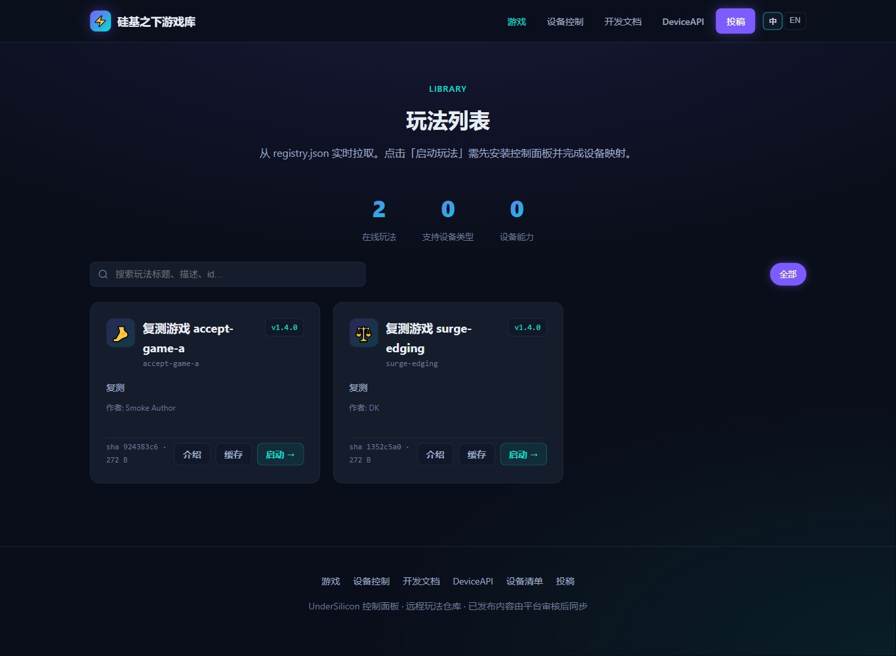

### 5.2（问题 3.2）归属指定可以撤销

**修复内容**

- 新增接口 `POST /api/admin/game-owners/{gameId}/delete`（`game-platform/api.go` 路由 + `payout_handlers.go` 的 `handleAdminGameOwnerAction`），风格与 `POST /api/admin/payouts/{id}/delete` 一致；删除逻辑在 `ownership.go` 的 `removeGameOwner`，没有指定归属时返回 404 `该游戏没有手工指定的归属`。
- 审核后台「归属指定」列表加「操作」列与「撤销」按钮：点击后就地变成「撤销后按原判定？确认撤销 / 取消」，页面内实现，未使用 `window.confirm`。确认后归属回落到原判定。

**复测操作与结果**

1. `surge-edging` 指定归属给 DK / `author2@example.com`，列表出现该行与「撤销」按钮。
2. 点「撤销」→ 就地出现「撤销后按原判定？确认撤销 / 取消」二次确认。
3. 点「确认撤销」→ 提示「归属已撤销，该游戏回到原来的归属判定。」，列表回到「还没有手工指定的归属。」
4. 撤销后 `surge-edging` 归属回落：`/api/admin/community-games` 里作者变成 `Platform Team`（`mobile-admin`）——因为它的 release 全部是官方导入 + 管理员发布，原判定即官方保留；同时 `registry.json` 里该游戏仍是 `authorName: DK`（上一次以 DK 署名发布的内容没有被改写）。

**证据**：

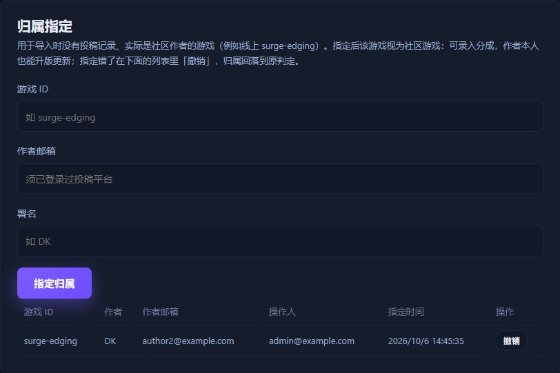

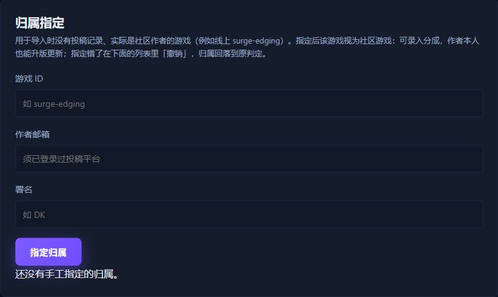

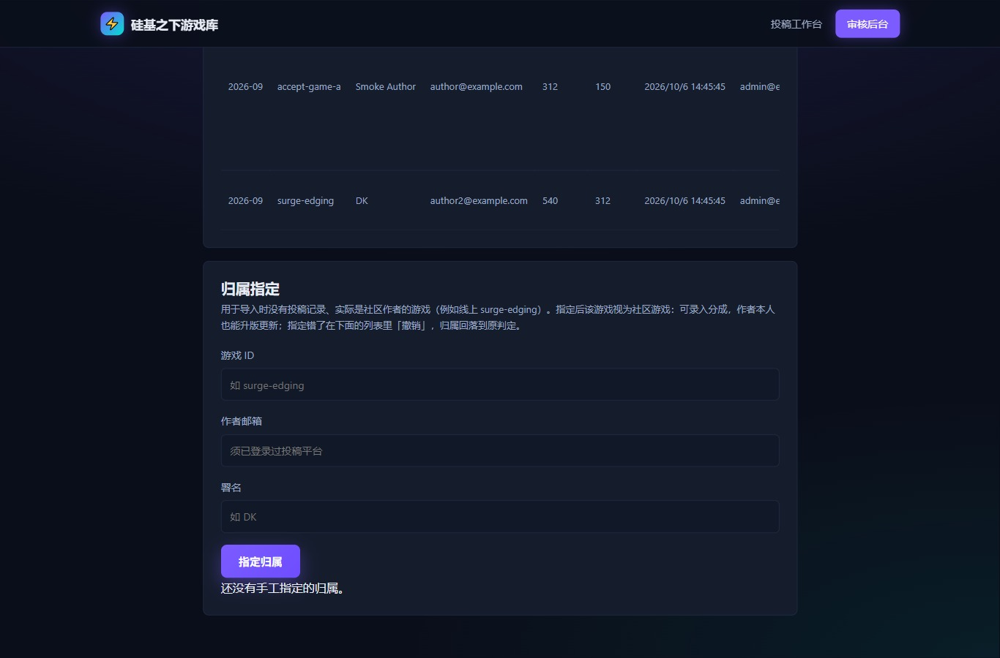

### 5.3（问题 3.3）社区游戏列表取当前 active release

**修复内容**

- `game-platform/payout_handlers.go` 的 `listCommunityGames`：版本与标题改为取**当前 active release**；没有 active（全部下架）时才取最后一条 release，并把状态显示为「已下架」。标题解析抽成 `entryTitle` 小函数，不再受「作者非空」条件影响。

**复测操作与结果**

- `accept-game-a`：1.0.0 → 1.1.0 → 1.2.0 → 1.3.0，中间无下架 → 列表显示 `v1.3.0 / 已上线`（当前 active）。
- `retest-revoked`：发布 1.0.0 后下架 → 列表显示 `v1.0.0 / 已下架`（取最后一条并标记已下架）。
- 页面「社区游戏与作者」表格与下拉均按 active 版本展示。

**证据**：

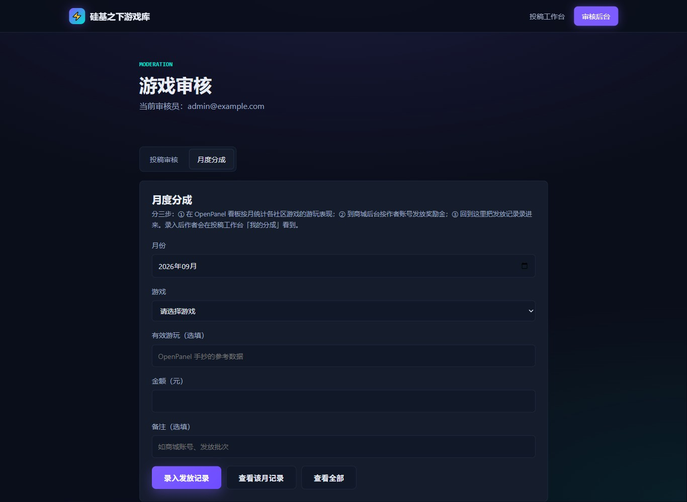

### 5.4（问题 4）发放记录 / 社区游戏表格不再溢出卡片

**修复内容**

- `play-registry/assets/js/admin.js`：新增 `tableBox()`，给所有 `.payout-table` 外面套一层 `.table-scroll` 容器（发放记录、社区游戏与作者、归属指定三张表都走同一个 `table()` 构建函数）；备注列加 `payout-note-cell` 类，让它换行而不是把表格撑宽。
- `play-registry/assets/css/site.css`：`.table-scroll { width: 100%; max-width: 100%; overflow-x: auto; }`；`.payout-table td.payout-note-cell { white-space: normal; overflow-wrap: anywhere; min-width: 140px; max-width: 260px; }`；窄屏（≤820px）给表格一个 `min-width: 640px`，让内容在容器内横向滚动。顺带给 `.platform-form` 的 `label/input/select` 加 `min-width: 0`，表单字段在手机宽度也不再顶出卡片。

**复测操作与结果**

- 1366px 宽（桌面）：`document.scrollingElement.scrollWidth` = 1366 = 视口宽，页面上**没有任何元素** `getBoundingClientRect().right` 超出视口；发放记录表格自身宽 1049px，在 763px 的滚动容器内（`overflow-x: auto`），卡片宽 811px 不再被撑破，备注与「操作」列都在卡片内可见。
- 400px 宽（手机）：页面 `scrollWidth` = 385 ≤ 400，同样没有元素溢出视口；表格在 307px 的滚动容器里横向滚动，备注列换行显示，卡片本身宽度 343px 未被撑破。
- 社区游戏与作者表格同样处理，两种宽度下都在卡片内。

**证据**：

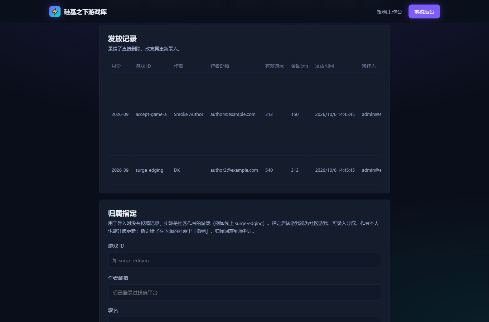

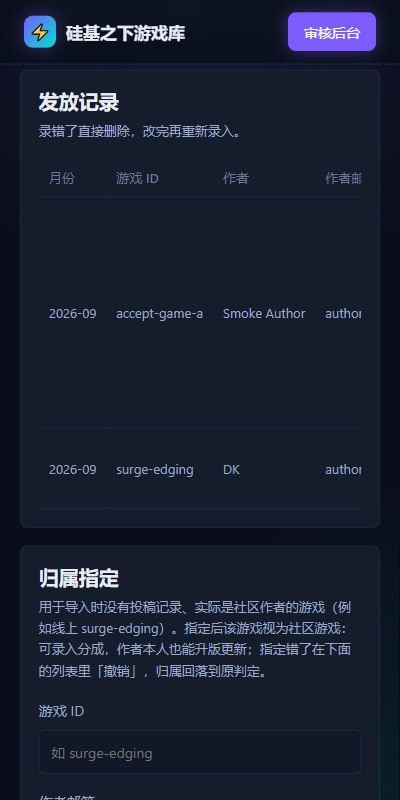

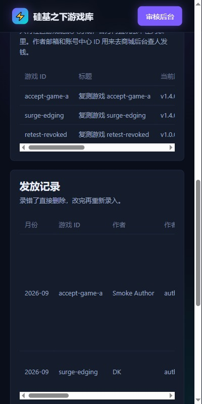

### 5.5 修复后的自动化测试

| 项目 | 命令 | 结果 |
| --- | --- | --- |
| game-platform | `gofmt -l . && go vet ./... && go test ./... -count=1` | `gofmt -l` 无输出，`go vet` 无告警，`ok ... 8.230s`，**32 个 Test 全通过**（修复前 29 个） |
| play-registry | `npm test` | `tests 29 / pass 29 / fail 0`（用例数不变） |
| play-registry | `npm run build` | `registry.json: 8 games`，构建成功 |

新增的 3 个用例覆盖本次修复：

- `TestPublishKeepsOwnerAuthorName`：管理员代发不改署名；归属指定后管理员代发显示指定署名；作者本人更新可改署名；官方保留 ID 由管理员发布保持原行为。
- `TestRemoveGameOwnerRestoresOriginalOwnership`：撤销后导入游戏回到「官方保留」、社区游戏回到「最早社区 release 作者」；重复撤销返回 `errGameOwnerGone`。
- `TestCommunityGamesUseActiveRelease`：有 active 时版本/标题取 active；全部下架时取最后一条并标记 `revoked`。

`TestAdminGameOwnerRoutes` 也补了撤销路由的权限与幂等断言（非管理员 403、删除成功、重复删除 404、列表清空）。


### 5.6 最终复核补充（协调者）

复核 5.4 截图时发现发放记录每行被撑到约 230px 高。原因有两个：

- 最后一列 `td` 被设成 `display: flex`，单元格不再按表格布局排版。
- 备注列用了 `overflow-wrap: anywhere`，在表格里会把这一列的最小宽度压到一个字。

已改 `play-registry/assets/css/site.css`：

- 操作列恢复为普通单元格，`white-space: nowrap`，按钮之间用 margin 留间距。
- 备注列改为 `overflow-wrap: break-word`。
- 表格滚动容器加 `color-scheme: dark`，横向滚动条跟随深色主题。

复测：两条带长备注的记录，行高 102px（来自备注折成三行，不再逐字换行）；滚动容器的 `color-scheme` 为 `dark`。

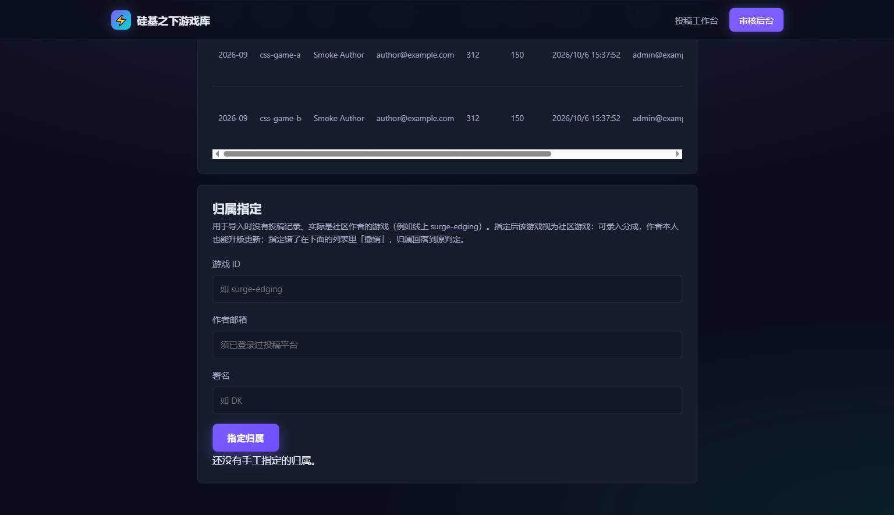

截图中滚动条仍是改 `color-scheme` 之前的白色；之后 neo 截图接口持续超时，改后的效果只用页面实测值确认，没有补拍。
